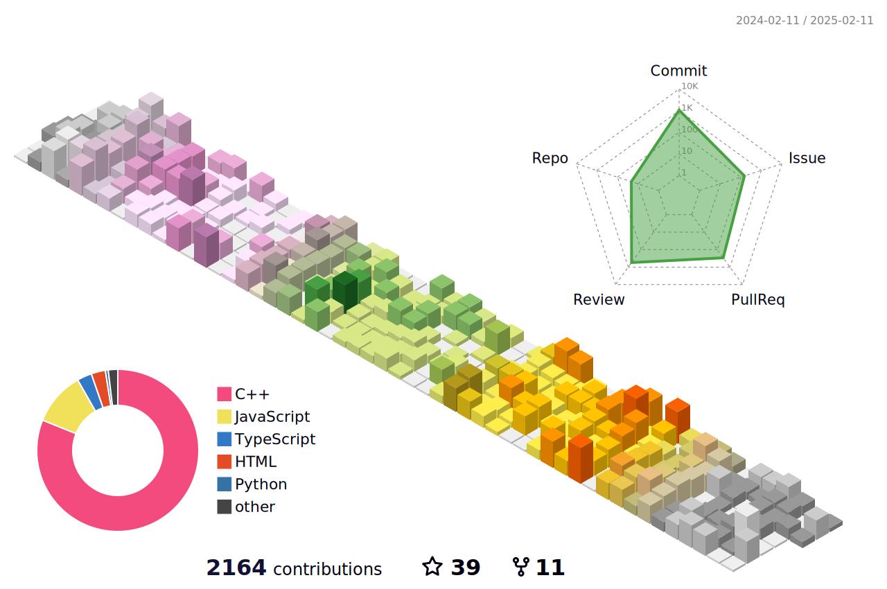

## 🙋‍♂️ About Me
- 👨🏼‍🎓 Computer Engineering student at Lovely Professional University (LPU).
- 👨‍💻 Qualify in Goldman Sachs campus engineering hiring program.
- 🤖 Core Contributor to Node.js REPL enhancements.
- 👯 Developed 150+ special mathematical functions in C & JavaScript.
- 👯 Optimized JavaScript probability distributions, achieving 10,000x speed improvements over SciPy.
- ✨ Leader of web development projects at BetaLabs.
- ✨ Strong background in Data Structures, Algorithms, and Competitive Programming.
- 🌱 Machine Learning Engineer @Warner Bros. Discovery.
- 👨‍💻 Summer '2024 @QuansightLabs as Open Source Developer Intern.
- 🤖 Software Development Intern @Warner Bros. Discovery in Summer'2024.
- 👯 I’m looking to collaborate on open source projects.
- 📫 How to reach me: <a href="mailto:rejoansardar620@gmail.com">rejoansardar620@gmail.com</a> / <a href="mailto:rejoan@lpu.in">rejoan@lpu.in</a>
## 🚀 Languages and Tools

## 📊 Github Stats
\
PS: Top Languages are metric of language that my public code contains it doesnot reflect my experience or skill level.\
<!--  -->
## 🚀 Github 3D Contribution

## ❤ Profile Views and Followers
 
<!--
**Rejoan-Sardar/Rejoan-Sardar** is a ✨ _special_ ✨ repository because its `README.md` (this file) appears on your GitHub profile.

Here are some ideas to get you started:

- 🔭 I’m currently working on ...
- 🌱 I’m currently learning ...
- 👯 I’m looking to collaborate on ...
- 🤔 I’m looking for help with ...
- 💬 Ask me about ...
- 📫 How to reach me: ...
- 😄 Pronouns: ...
- ⚡ Fun fact: ...
-->
